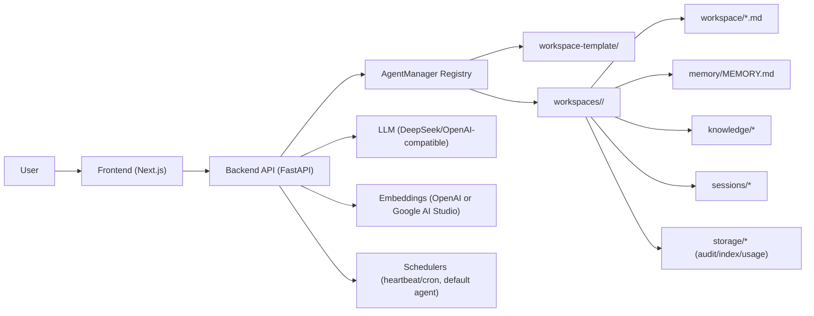

# Mini-OpenClaw (LangChain)

Local-first multi-agent coding assistant with:

- FastAPI backend (`backend/`)
- Next.js frontend (`frontend/`)
- Workspace templates and per-agent isolated workspaces

## High-Level Architecture



## Project Layout

- `/backend`: API, agent orchestration, tools, retrieval, schedulers.
- `/frontend`: UI, state store, streaming renderer, usage dashboard.

## Quick Start

Backend:

```bash
cd backend
uv venv .venv
uv pip install --python .venv/bin/python -r requirements.txt
cp .env.example .env
uv run --python .venv/bin/python uvicorn app:app --host 127.0.0.1 --port 8002
```

Frontend:

```bash
cd frontend
npm install
npm run dev
```

Open `http://localhost:3000`.
