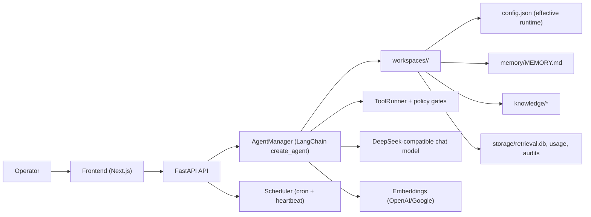

# Mini-OpenClaw LangChain

[](#testing) [](#testing) [](#quickstart) [](#architecture)

Reliability-first, local-first agent workspace inspired by OpenClaw patterns with minimal overhead on top of LangChain 1.x:

- Multi-agent isolated workspaces.
- Safer tool/network controls (`fetch_url`, `web_search`, terminal env scrubbing).
- Scheduler API + UI (`/scheduler`) for cron and heartbeat operations.
- SQLite-first retrieval index with FTS prefilter and JSON migration fallback.
- Streaming chat with retrieval/tool traces and markdown rendering.

## Architecture



## Feature Matrix

| Area | Status | Notes |
| --- | --- | --- |
| Multi-agent workspaces | Ready | Per-agent sessions, memory, knowledge, usage, scheduler state. |
| Chat + streaming | Ready | SSE streaming, debug events, tool/retrieval traces. |
| Tool hardening | Ready | URL scheme/host controls, private network blocking, env scrubbing. |
| Scheduler API | Ready | Cron CRUD, run-now, runs/failures, heartbeat config/runs. |
| Scheduler UI | Ready | `/scheduler` page for cron + heartbeat controls and history. |
| Retrieval engine | Ready | SQLite + FTS5 prefilter, semantic+lexical blending, legacy JSON migration. |
| Runtime config editor | Ready | Agent-scoped JSON editor in Inspector via `/api/config/runtime`. |
| Usage analytics | Ready | Model breakdown, trend chart, CSV export. |

## Security Model

- File APIs are workspace-root scoped and path-guarded.
- Tool policy gates autonomous triggers (`heartbeat`, `cron`) with explicit allowlists.
- `fetch_url` defaults:
  - allowed schemes: `http`, `https`
  - private/loopback/link-local blocking enabled
  - redirect cap + content-size cap
- Terminal tool executes with sanitized environment (secret-like vars stripped).
- CORS + trusted hosts + rate limit middleware enabled by default.

Detailed docs:

- `docs/security/sandbox-and-network.md`
- `docs/operations/scheduler.md`
- `docs/retrieval/sqlite-index.md`

## Quickstart

### 1) Backend

```bash
cd backend
uv venv .venv
uv pip install --python .venv/bin/python -r requirements.txt
cp .env.example .env
uv run --python .venv/bin/python uvicorn app:app --host 127.0.0.1 --port 8002
```

### 2) Frontend

```bash
cd frontend
npm install
npm run dev
```

Open [http://localhost:3000](http://localhost:3000).

## Testing

### Backend

```bash
cd backend
./.venv/bin/pytest -q
```

### Frontend

```bash
cd frontend
npm run test:run
npm run build
```

## Repository Layout

- `backend/`: FastAPI APIs, AgentManager, tools, scheduler, retrieval.
- `frontend/`: Next.js app router UI, API client, app store, scheduler/usage/workspace pages.
- `docs/`: operations, security, retrieval, product/reference docs.

## Roadmap (Near-term)

- Add stronger process-level sandboxing for terminal execution (beyond env scrubbing).
- Expand scheduler observability (job duration/latency aggregates).
- Add richer agent management UX (bulk actions, templates, diffable runtime config).
- Add retrieval quality eval fixtures to compare ranking drift across releases.
