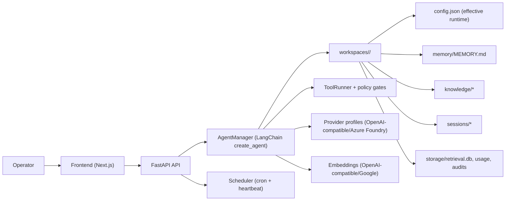

# Mini-OpenClaw LangChain

[](#testing) [](https://opensource.org/licenses/MIT)  [](#quickstart) [](#architecture) 

Reliability-first, local-first agent workspace inspired by OpenClaw patterns with minimal overhead on top of LangChain:

- Multi-agent isolated workspaces.
- Safer tool/network controls (`fetch_url`, `web_search`, terminal env scrubbing).
- Scheduler API + UI (`/scheduler`) for cron and heartbeat operations.
- SQLite-first retrieval index with FTS prefilter and JSON migration fallback.
- Streaming chat with retrieval/tool traces and markdown rendering.

Canonical tool surface (aliases removed):

- `terminal`, `python_repl`, `fetch_url`
- `read_files`, `read_pdf`, `search_knowledge_base`, `web_search`
- `sessions_list`, `session_history`, `agents_list`
- `scheduler_cron_jobs`, `scheduler_cron_runs`
- `scheduler_heartbeat_status`, `scheduler_heartbeat_runs`
- `apply_patch`

## Architecture


```mermaid
flowchart LR
  U["Operator"] --> FE["Frontend (Next.js)"]
  FE --> API["FastAPI API"]
  API --> AM["AgentManager (LangChain create_agent)"]
  AM --> WS["workspaces/<agent_id>/"]
  WS --> CFG["config.json (effective runtime)"]
  WS --> MEM["memory/MEMORY.md"]
  WS --> KNOW["knowledge/*"]
  WS --> SESS["sessions/*"]
  WS --> STORE["storage/retrieval.db, usage, audits"]
  API --> SCH["Scheduler (cron + heartbeat)"]
  AM --> TOOLS["ToolRunner + policy gates"]
  AM --> LLM["Provider profiles (OpenAI-compatible/Azure Foundry)"]
  AM --> EMB["Embeddings (OpenAI-compatible/Google)"]
```

## Feature Matrix

| Area                    | Status | Notes                                                                                 |
| ----------------------- | ------ | ------------------------------------------------------------------------------------- |
| Multi-agent workspaces  | Ready  | Per-agent sessions, memory, knowledge, usage, scheduler state.                        |
| Chat + streaming        | Ready  | SSE streaming, debug events, tool/retrieval traces.                                   |
| Session compression     | Ready  | Context summarization and history truncation via `/compress` API.                     |
| Tool hardening          | Ready  | URL scheme/host controls, private network blocking, env scrubbing.                    |
| Scheduler API           | Ready  | Cron CRUD, run-now, runs/failures, heartbeat config/runs.                             |
| Scheduler observability | Ready  | Windowed duration/latency aggregates + timeseries (`1h`→`30d`).                       |
| Scheduler UI            | Ready  | `/scheduler` page for cron + heartbeat controls and history.                          |
| Agent management UX     | Ready  | Bulk delete/export/runtime patch, template-driven runtime editing, config diff view.  |
| Retrieval engine        | Ready  | SQLite + FTS5 prefilter, semantic+lexical blending, legacy JSON migration.            |
| Runtime config editor   | Ready  | Agent-scoped JSON editor in Inspector via `/api/v1/agents/{agent_id}/config/runtime`. |
| Usage analytics         | Ready  | Model breakdown, trend chart, CSV export.                                             |

## Security Model

- `/api/v1/*` routes are protected by the admin credential in `APP_ADMIN_TOKEN` (except health/readiness).
- Browser clients now use an `HttpOnly` `app_admin_token` cookie; non-browser clients can still send `Authorization: Bearer <APP_ADMIN_TOKEN>`.
- File APIs are workspace-root scoped and path-guarded.
- Tool policy gates autonomous triggers (`heartbeat`, `cron`) with explicit allowlists.
- `fetch_url` defaults:
  - allowed schemes: `http`, `https`
  - private/loopback/link-local blocking enabled
  - redirect cap + content-size cap
- Terminal tool executes with sanitized environment (secret-like vars stripped).
- CORS + trusted hosts + rate limit middleware enabled by default.

## Quickstart

### 1) Backend

```bash
cd backend
uv venv .venv
uv pip install --python .venv/bin/python -r requirements.txt
# Optional PDF extraction support:
# uv pip install --python .venv/bin/python -r requirements-pdf.txt
cp .env.example .env
uv run --python .venv/bin/python uvicorn app:app --host 127.0.0.1 --port 8000
```

Set at least:

- `APP_ADMIN_TOKEN`
- one key for your active `DEFAULT_LLM_PROFILE` (for example `DEEPSEEK_API_KEY`, `OPENAI_API_KEY`, or `AZURE_FOUNDRY_API_KEY`)

Optional but useful for this release:

- `LANGSMITH_API_KEY` (when tracing is enabled)

### 2) Frontend

```bash
cd frontend
npm install
npm run dev
```

Preferred local auth flow:

- `./oml start` or backend single-origin proxy mode: the backend issues the `app_admin_token` cookie automatically.
- Direct `frontend` dev server usage: set server-only `APP_ADMIN_TOKEN` in `frontend/.env.local` so `/api/auth/session` can bootstrap the same cookie on first API auth challenge.

Open [http://127.0.0.1:8000](http://127.0.0.1:8000) when using `./oml start` (backend single-origin proxy enabled).
Direct frontend dev server remains available at [http://localhost:3000](http://localhost:3000).

Manual split-server development is also supported without changing frontend code:

- backend: `uv run --python .venv/bin/python uvicorn app:app --host 127.0.0.1 --port 8000`
- frontend: `npm run dev`
- Next.js rewrites `/api/v1/*` to `http://127.0.0.1:8000/api/v1/*` by default
- Optional override for non-default manual backend target: `NEXT_DEV_API_PROXY_URL`

## Repo-local CLI (`./oml`)

`oml` is a repo-local command (`./oml`) for running and operating Mini-OpenClaw locally without requiring global installation. It manages both backend and frontend execution, handles logs and PIDs, and runs health checks.

### Requirements

- `bash`
- `uv`
- `node` + `npm`
- `curl`

### Quick Start

```bash
./oml help
./oml start
./oml status
./oml logs --follow
./oml stop
```

When started via `./oml start`, the CLI defaults `OML_ENABLE_FRONTEND_PROXY=true`, so the backend serves the app directly at [http://127.0.0.1:8000](http://127.0.0.1:8000). Set `OML_ENABLE_FRONTEND_PROXY=inherit` if you want backend process env or `backend/.env` to control proxy behavior instead.

### Core Commands

- **`start [target]`**: Starts services (`all`, `backend`, or `frontend`) in detached mode. It writes PID files to `.oml/run/`, logs to `.oml/log/`, and waits for health checks to pass. Idempotent if already running.
- **`stop [target]`**: Stops managed services safely. Uses graceful SIGTERM first, with a SIGKILL fallback. Refuses to kill unmanaged PIDs.
- **`restart [target]`**: Equivalent to `stop` followed by `start`.
- **`status`**: Prints service-level status including state (`running`/`stopped`), PID, health (`ok`, `degraded`, `down`), and service URL.
- **`logs [target]`**: Shows logs from `.oml/log`. Supports `--follow` and `--lines N`.
- **`update`**: Safely syncs local dependencies (`uv` for Python, `npm ci` for Node) without mutating git history.
- **`doctor`**: Validates prerequisites, checks `backend/.env`, and detects port conflicts.
- **`ports`**: Prints effective URL/ports used by the runtime config.
- **`version` / `help`**: Prints component versions and CLI usage.

### Runtime State & Configuration

The CLI stores its runtime state in `.oml/run/` and `.oml/log/`.

You can override defaults by creating an `.oml/config.env` file (or by exporting environment variables):

```bash
OML_BACKEND_HOST=127.0.0.1
OML_BACKEND_PORT=8000
OML_FRONTEND_HOST=127.0.0.1
OML_FRONTEND_PORT=3000
OML_HEALTH_TIMEOUT_SECONDS=30
OML_ENABLE_FRONTEND_PROXY=true
OML_FRONTEND_PROXY_URL=http://127.0.0.1:3000
```

Proxy modes:

- `true`: CLI exports backend proxy envs explicitly
- `false`: CLI disables backend proxy explicitly
- `inherit`: CLI does not export backend proxy envs; backend process env and `backend/.env` decide

Windows-native CLI is available as `.\oml.ps1` with the same command surface as `./oml`.

### Exit Codes

- `0`: Success | `1`: Invalid command/argument | `2`: Missing binary
- `3`: Health/start timeout | `4`: Unsafe stop or runtime failure
- `5`: Update failure | `6`: Doctor critical failure

### Troubleshooting

- **Start fails with timeout**: Check `.oml/log/*.log`. Ensure `backend/.env` is correctly configured and `frontend/node_modules` exists.
- **Stop refuses to kill PID**: The PID file doesn't match an expected managed process. Run `rm -f .oml/run/*.pid` to clear stale PIDs, then retry.

## Testing

### Backend

```bash
cd backend
./.venv/bin/pytest -q
```

### Frontend

```bash
cd frontend
npm run test:run
npm run build
```

## Repository Layout

- `backend/`: FastAPI APIs, AgentManager, tools, scheduler, retrieval.
- `frontend/`: Next.js app router UI, API client, app store, scheduler/usage/workspace pages.

## New API Highlights

- Scheduler metrics:
  - `GET /api/v1/agents/{agent_id}/scheduler/metrics?window=1h|4h|12h|24h|7d|30d`
  - `GET /api/v1/agents/{agent_id}/scheduler/metrics/timeseries?...&bucket=1m|5m|15m|1h`
- Agent bulk + templates:
  - `POST /api/v1/agents/bulk-delete`
  - `POST /api/v1/agents/bulk-export`
  - `POST /api/v1/agents/bulk-runtime-patch`
  - `GET /api/v1/agents/templates`
  - `GET /api/v1/agents/templates/{template_name}`
  - `GET /api/v1/agents/{agent_id}/runtime-diff?baseline=default|agent:<id>|template:<name>`
