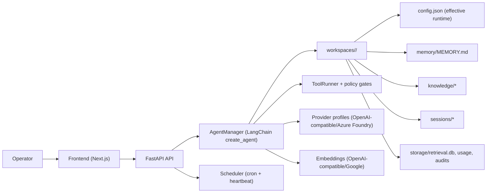

<div align="center">

# 🦾 Mini-OpenClaw LangChain

A reliability-first, local-first agent workspace built on LangChain.
Run powerful multi-agent systems with hardened tooling, a built-in scheduler, and a streaming chat UI — entirely on your own machine.

---

[](https://github.com/kaiqiangh/mini-openclaw-langchain/actions/workflows/ci.yml)
[](https://opensource.org/licenses/MIT)

[](#quickstart)
[](#architecture)


[Getting Started](#quickstart) · [Architecture](#architecture) · [Features](#features) · [API Highlights](#api-highlights) · [Contributing](#contributing)

</div>

---

## What is this?

Mini-OpenClaw is an **agent workspace** you spin up locally in minutes. It gives each agent its own isolated environment — memory, knowledge base, sessions, storage — wired to a hardened tool layer and a scheduler for cron and heartbeat operations. A Next.js UI and a FastAPI backend work together out of the box, with a CLI (`./oml`) that handles everything.

Think of it as a **batteries-included LangChain runtime** for teams and individuals who want reliability and observability without the overhead of a managed cloud service.

---

## Features

### 🤖 Multi-Agent Workspaces

Every agent lives in its own isolated directory (`workspaces/<agent_id>/`) with dedicated memory, knowledge files, sessions, retrieval index, usage logs, and audit trails. Agents never step on each other.

### 💬 Streaming Chat with Traces

Real-time SSE streaming with tool and retrieval trace events rendered inline. Full markdown support. Compress long sessions via `/compress` when context grows large.

### 🗓️ Scheduler (Cron + Heartbeat)

A first-class scheduler API and `/scheduler` UI page for defining cron jobs, running them on-demand, and monitoring heartbeat operations — with windowed latency aggregates and time-series metrics up to 30 days.

### 🔍 SQLite-First Retrieval

Hybrid semantic + lexical retrieval powered by SQLite FTS5 prefiltering. Automatic migration from legacy JSON stores. No external vector DB required.

### 🛡️ Hardened Tool Layer

Security-conscious defaults across all tools:

- **`fetch_url`**: allowed schemes (`http`/`https`), private/loopback blocking, redirect and content-size caps.
- **`terminal`**: sanitized environment with secret-like vars stripped.
- **`web_search`**: policy-gated autonomous triggers for cron/heartbeat contexts.

### 🧰 Rich Tool Surface

```text
terminal            python_repl          fetch_url
read_files          read_pdf             search_knowledge_base
web_search          sessions_list        session_history
agents_list         scheduler_cron_jobs  scheduler_cron_runs
scheduler_heartbeat_status               scheduler_heartbeat_runs
apply_patch
```

### 📊 Usage Analytics

Per-agent model breakdown, trend charts, and CSV export for cost tracking and capacity planning.

### 🖥️ Agent Management UX

Bulk delete, bulk export, bulk runtime patch, template-driven config creation, and a live config diff view — all from the UI or API.

---

## Architecture


```mermaid
flowchart LR
  U["Operator"] --> FE["Frontend (Next.js)"]
  FE --> API["FastAPI API"]
  API --> AM["AgentManager (LangChain create_agent)"]
  AM --> WS["workspaces/<agent_id>/"]
  WS --> CFG["config.json (effective runtime)"]
  WS --> MEM["memory/MEMORY.md"]
  WS --> KNOW["knowledge/*"]
  WS --> SESS["sessions/*"]
  WS --> STORE["storage/retrieval.db, usage, audits"]
  API --> SCH["Scheduler (cron + heartbeat)"]
  AM --> TOOLS["ToolRunner + policy gates"]
  AM --> LLM["Provider profiles (OpenAI-compatible/Azure Foundry)"]
  AM --> EMB["Embeddings (OpenAI-compatible/Google)"]
```

Stack: Python 3.13 · FastAPI · LangChain 1.2 · SQLite · Next.js 15 · React

---

## Quickstart

### Prerequisites

- `bash`, `uv`, `node` + `npm`, `curl`

### Option A — One command (recommended)

```bash
./oml start
```

This starts both backend and frontend, runs health checks, and serves the app at **http://{YOUR_URL}:8000**.

### Option B — Manual split-server

#### Backend

```bash
cd backend
uv venv .venv
uv pip install --python .venv/bin/python -r requirements.txt
cp .env.example .env   # set APP_ADMIN_TOKEN + your LLM provider key
uv run --python .venv/bin/python uvicorn app:app --host 127.0.0.1 --port 8000
```

#### Frontend

```bash
cd frontend
npm install
npm run dev            # available at http://localhost:3000
```

Next.js rewrites `/api/v1/*` → `http://127.0.0.1:8000/api/v1/*` automatically.

### Required environment variables

| Variable                                                        | Required | Description                               |
| --------------------------------------------------------------- | -------- | ----------------------------------------- |
| `APP_ADMIN_TOKEN`                                               | ✅       | Admin secret for all `/api/v1/*` routes   |
| `OPENAI_API_KEY` / `DEEPSEEK_API_KEY` / `AZURE_FOUNDRY_API_KEY` | ✅       | Key for your active `DEFAULT_LLM_PROFILE` |
| `LANGSMITH_API_KEY`                                             | Optional | Enable LangSmith tracing                  |

> **PDF extraction support:** `uv pip install --python .venv/bin/python -r requirements-pdf.txt`

---

## Security Model

Mini-OpenClaw applies a defense-in-depth approach:

- **Auth:** All `/api/v1/*` routes require `APP_ADMIN_TOKEN` — via `Authorization: Bearer` header (API clients) or an `HttpOnly` cookie (browser clients). Health and readiness endpoints are exempt.
- **File APIs:** Workspace-root scoped with path traversal guards.
- **Tool policy gates:** Autonomous scheduler triggers (`heartbeat`, `cron`) use explicit allowlists.
- **Network controls:** `fetch_url` blocks private/loopback/link-local addresses by default.
- **Terminal sandboxing:** Environment is scrubbed of secret-like variables before execution.
- **Middleware:** CORS + trusted hosts + rate limiting enabled by default.

---

## CLI Reference (`./oml`)

The repo-local CLI manages the full lifecycle of your local deployment. A PowerShell equivalent (`.\oml.ps1`) is available for Windows.

| Command                  | Description                                            |
| ------------------------ | ------------------------------------------------------ |
| `./oml start [target]`   | Start `all`, `backend`, or `frontend` in detached mode |
| `./oml stop [target]`    | Graceful stop (SIGTERM → SIGKILL fallback)             |
| `./oml restart [target]` | Stop + start                                           |
| `./oml status`           | Print service state, PID, health, and URL              |
| `./oml logs [target]`    | Tail logs; supports `--follow` and `--lines N`         |
| `./oml update`           | Sync Python and Node dependencies without touching git |
| `./oml doctor`           | Validate prerequisites, `.env`, and port conflicts     |
| `./oml ports`            | Print effective URLs and ports                         |
| `./oml version`          | Print component versions                               |

### Runtime config

Create `.oml/config.env` to override defaults:

```bash
OML_BACKEND_HOST=127.0.0.1
OML_BACKEND_PORT=8000
OML_FRONTEND_HOST=127.0.0.1
OML_FRONTEND_PORT=3000
OML_HEALTH_TIMEOUT_SECONDS=30
OML_ENABLE_FRONTEND_PROXY=true   # true | false | inherit
OML_FRONTEND_PROXY_URL=http://127.0.0.1:3000
```

Exit codes: `0` success · `1` invalid args · `2` missing binary · `3` health timeout · `4` unsafe stop · `5` update failure · `6` doctor critical failure

---

## Feature Status

| Area                    | Status   | Notes                                                                   |
| ----------------------- | -------- | ----------------------------------------------------------------------- |
| Multi-agent workspaces  | ✅ Ready | Per-agent sessions, memory, knowledge, usage, scheduler state           |
| Chat + streaming        | ✅ Ready | SSE streaming, debug events, tool/retrieval traces                      |
| Session compression     | ✅ Ready | Context summarization and history truncation via `/compress`            |
| Tool hardening          | ✅ Ready | URL scheme/host controls, private network blocking, env scrubbing       |
| Scheduler API           | ✅ Ready | Cron CRUD, run-now, runs/failures, heartbeat config/runs                |
| Scheduler observability | ✅ Ready | Windowed duration/latency aggregates + timeseries (`1h` → `30d`)        |
| Scheduler UI            | ✅ Ready | `/scheduler` page for cron + heartbeat controls and history             |
| Agent management UX     | ✅ Ready | Bulk delete/export/runtime patch, template-driven config, diff view     |
| Retrieval engine        | ✅ Ready | SQLite + FTS5 prefilter, semantic+lexical blending, JSON migration      |
| Runtime config editor   | ✅ Ready | Agent-scoped JSON editor via `/api/v1/agents/{agent_id}/config/runtime` |
| Usage analytics         | ✅ Ready | Model breakdown, trend chart, CSV export                                |

---

## API Highlights

Important endpoints most operators and clients use are grouped below.

### Agents

Agent lifecycle, bulk actions, templates, runtime diffs, and per-agent tool policy.

```text
GET|POST|DELETE /api/v1/agents
POST             /api/v1/agents/bulk-delete
POST             /api/v1/agents/bulk-export
POST             /api/v1/agents/bulk-runtime-patch
GET              /api/v1/agents/templates
GET              /api/v1/agents/templates/{template_name}
GET              /api/v1/agents/{agent_id}/runtime-diff?baseline=default|agent:<id>|template:<name>
GET              /api/v1/agents/{agent_id}/tools
PUT              /api/v1/agents/{agent_id}/tools/selection
```

### Sessions and Chat

Conversation execution, session lifecycle, transcript history, compression, and title generation.

```text
POST             /api/v1/agents/{agent_id}/chat
GET|POST         /api/v1/agents/{agent_id}/sessions
GET              /api/v1/agents/{agent_id}/sessions/{session_id}/messages
GET              /api/v1/agents/{agent_id}/sessions/{session_id}/history
PUT|DELETE       /api/v1/agents/{agent_id}/sessions/{session_id}
POST             /api/v1/agents/{agent_id}/sessions/{session_id}/archive
POST             /api/v1/agents/{agent_id}/sessions/{session_id}/restore
POST             /api/v1/agents/{agent_id}/sessions/{session_id}/compress
POST             /api/v1/agents/{agent_id}/sessions/{session_id}/generate-title
```

### Files and Config

Workspace files, skill catalogs, RAG/runtime config, and tracing toggles.

```text
GET|POST         /api/v1/agents/{agent_id}/files
GET              /api/v1/agents/{agent_id}/files/index
GET              /api/v1/skills
GET              /api/v1/agents/{agent_id}/skills
GET|PUT          /api/v1/agents/{agent_id}/config/rag-mode
GET|PUT          /api/v1/agents/{agent_id}/config/runtime
GET|PUT          /api/v1/config/tracing
```

### Usage

Token accounting, usage rollups, and cost analytics.

```text
GET              /api/v1/agents/{agent_id}/tokens/session/{session_id}
POST             /api/v1/agents/{agent_id}/tokens/files
GET              /api/v1/agents/{agent_id}/usage/summary
GET              /api/v1/agents/{agent_id}/usage/records
```

### Scheduler

Cron job control, heartbeat configuration, run history, and observability metrics.

```text
GET|POST         /api/v1/agents/{agent_id}/scheduler/cron/jobs
PUT|DELETE       /api/v1/agents/{agent_id}/scheduler/cron/jobs/{job_id}
POST             /api/v1/agents/{agent_id}/scheduler/cron/jobs/{job_id}/run
GET              /api/v1/agents/{agent_id}/scheduler/cron/runs
GET              /api/v1/agents/{agent_id}/scheduler/cron/failures
GET|PUT          /api/v1/agents/{agent_id}/scheduler/heartbeat
GET              /api/v1/agents/{agent_id}/scheduler/heartbeat/runs
GET              /api/v1/agents/{agent_id}/scheduler/metrics?window=1h|4h|12h|24h|7d|30d
GET              /api/v1/agents/{agent_id}/scheduler/metrics/timeseries?...&bucket=1m|5m|15m|1h
```

### Traces

Persisted trace-event browsing across audit and run-event logs.

```text
GET              /api/v1/agents/{agent_id}/traces/events?window=...&event=...&trigger=...&run_id=...&session_id=...&q=...&limit=...&cursor=...
GET              /api/v1/agents/{agent_id}/traces/events/{event_id}
```

---

## Repository Layout

```text
.
├── backend/        # FastAPI app, AgentManager, tools, scheduler, retrieval engine
├── frontend/       # Next.js app router UI, API client, store, scheduler/usage pages
├── oml             # Bash CLI (Linux/macOS)
└── oml.ps1         # PowerShell CLI (Windows)
```

---

## Testing

- Backend

```bash
cd backend
./.venv/bin/pytest -q
```

- Frontend

```bash
cd frontend
npm run test:run
npm run build
```

---

## Contributing

Contributions are welcome! Here’s how to get started:

1. Fork the repo and create a feature branch: `git checkout -b feat/your-feature`
1. Make your changes and add tests where applicable
1. Run the test suite (backend + frontend) to confirm nothing is broken
1. Open a pull request with a clear description of what changed and why

For larger changes, opening an issue first to discuss the approach is appreciated.

---

## License

[MIT](https://opensource.org/licenses/MIT) © Mini-OpenClaw contributors
