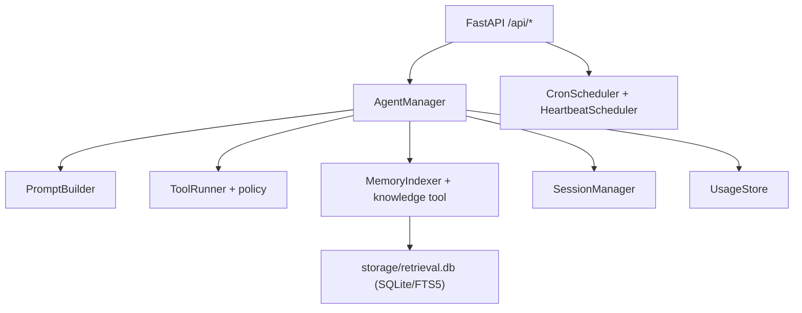

# Backend

FastAPI backend for Mini-OpenClaw LangChain.

## Core Responsibilities

- Multi-agent runtime management (`AgentManager`).
- Chat execution (sync + SSE stream) with LangChain `create_agent`.
- Tool execution with policy gates and audit trails.
- Scheduler runtime (cron + heartbeat) with API control.
- Retrieval over memory/knowledge using SQLite-first indexes.
- Per-agent usage accounting.

## Service Graph



## Runtime Config Matrix

| Path                                          | Purpose                                     |
| --------------------------------------------- | ------------------------------------------- |
| `runtime.retrieval.storage.engine`            | `sqlite` (default) or fallback `json`.      |
| `runtime.retrieval.storage.db_path`           | Relative DB path per agent workspace.       |
| `runtime.retrieval.storage.fts_prefilter_k`   | Candidate count before semantic scoring.    |
| `runtime.tool_network.allow_http_schemes`     | Allowed URL schemes for fetch tools.        |
| `runtime.tool_network.block_private_networks` | Block localhost/private/link-local targets. |
| `runtime.tool_network.max_redirects`          | Redirect safety cap.                        |
| `runtime.tool_network.max_content_bytes`      | Maximum fetched response size.              |
| `runtime.scheduler.api_enabled`               | Enable/disable scheduler API routes.        |
| `runtime.scheduler.runs_query_default_limit`  | Default limit for runs/failures queries.    |
| `runtime.heartbeat.*`                         | Heartbeat schedule + execution window.      |
| `runtime.cron.*`                              | Cron polling, retry/backoff, retention.     |

## LLM Model Selection (Tool Loop)

- Tool-enabled loops can be overridden with:
  - `TOOL_LOOP_MODEL` (global override for all configured models).
  - `TOOL_LOOP_MODEL_OVERRIDES` (per-model mapping).
- `TOOL_LOOP_MODEL_OVERRIDES` supports:
  - JSON object format (preferred): `{"source-model": "tool-model"}`
  - comma-separated key/value format: `source-model=tool-model,source2=tool2`
- If no override applies, the configured model is used as-is.

## API Reference

### Chat / Sessions / Agents

- `POST /api/chat`
- `GET|POST /api/sessions`
- `PUT|DELETE /api/sessions/{session_id}`
- `POST /api/sessions/{session_id}/archive`
- `POST /api/sessions/{session_id}/restore`
- `GET|POST|DELETE /api/agents`

### Files / Tokens / Usage

- `GET|POST /api/files`
- `GET /api/files/index`
- `GET /api/skills`
- `GET /api/tokens/session/{session_id}`
- `POST /api/tokens/files`
- `GET /api/usage/summary`
- `GET /api/usage/records`

### Config

- `GET|PUT /api/config/rag-mode`
- `GET|PUT /api/config/runtime` (validated, atomic write)

### Scheduler

- `GET|POST /api/scheduler/cron/jobs`
- `PUT|DELETE /api/scheduler/cron/jobs/{job_id}`
- `POST /api/scheduler/cron/jobs/{job_id}/run`
- `GET /api/scheduler/cron/runs`
- `GET /api/scheduler/cron/failures`
- `GET|PUT /api/scheduler/heartbeat`
- `GET /api/scheduler/heartbeat/runs`

## Threat Model (Current)

- Workspace path escape prevention in file tools/endpoints.
- URL fetch restrictions (scheme, host policy, content bounds, redirect cap).
- Terminal command deny-list plus environment secret scrubbing.
- Autonomous tool calls blocked unless explicitly allowlisted.
- API middleware:
  - trusted hosts
  - CORS restrictions
  - rate limiting
  - baseline hardening headers

Known limitation:

- Terminal execution is not a full process/container sandbox yet. See `docs/security/sandbox-and-network.md`.

## Retrieval Notes

- Default engine: SQLite (`storage/retrieval.db`) per agent.
- `index_meta` stores digest + schema version.
- `chunks_fts` provides lexical prefilter.
- Semantic + lexical blending is preserved from previous scoring.
- Legacy JSON index is imported on first SQLite use, and JSON read fallback remains available.

Reference: `docs/retrieval/sqlite-index.md`.

## Operations

- Scheduler run/failure logs are JSONL in each workspace `storage/`.
- Heartbeat skip states include `skipped_no_prompt` for empty/comment-only prompts.
- Cron and heartbeat write paths are lock-protected.

Reference: `docs/operations/scheduler.md`.

## Local Run

```bash
cd backend
uv venv --python=python3.13.7
uv pip install -r requirements.txt
cp .env.example .env
uv run uvicorn app:app --host 127.0.0.1 --port 8002
```

Health check:

```bash
curl http://127.0.0.1:8002/api/health
```

## Tests

```bash
cd backend
./.venv/bin/pytest -q
```
