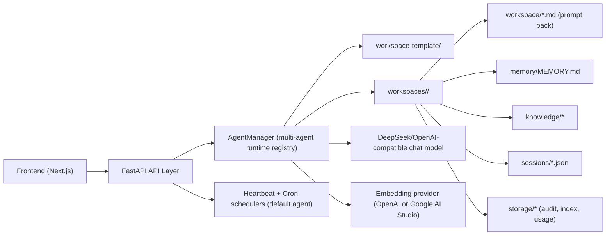

# Mini-OpenClaw Backend

FastAPI backend for Mini-OpenClaw with LangChain `create_agent`, SSE chat streaming, tool execution, retrieval, and autonomous schedulers.

## High-Level Architecture



## Workspace Model

- `workspace-template/` is the seed template.
- `workspaces/<agent_id>/` is created per agent from that template.
- Each agent workspace is isolated and has its own:
  - `workspace/` (SOUL/IDENTITY/USER/AGENTS/HEARTBEAT/BOOTSTRAP),
  - `memory/`,
  - `knowledge/`,
  - `sessions/`,
  - `storage/` (indexes, audit, usage).
- Shared code/config lives under `backend/`.

## Memory Search Strategy (Detailed)

`MemoryIndexer` performs retrieval on each agent’s own `memory/MEMORY.md`:

1. **Index build trigger**
   - Index rebuild happens when file hash changes or index is missing.
   - Save API also forces rebuild after writing `memory/MEMORY.md`.

2. **Chunking**
   - Memory text is split into overlapping character windows.
   - Current defaults: `size=256`, `overlap=32`.
   - Overlap preserves context across chunk boundaries.

3. **Embedding**
   - For each chunk, embeddings are generated using configured provider:
     - `openai` (`EMBEDDING_MODEL`)
     - `google_ai_studio` (`GOOGLE_EMBEDDING_MODEL`, e.g. `gemini-embedding-001`)
   - Embeddings are cached in `storage/memory_index/index.json`.

4. **Query-time retrieval**
   - Query gets an embedding vector.
   - Two signals are computed per chunk:
     - semantic similarity (`cosine_similarity`),
     - lexical term overlap (token containment count).

5. **Scoring**
   - Final score is blended:
     - semantic `0.7`
     - lexical `0.3`
   - Chunks with positive score are sorted descending.
   - Top-K (default 3) are returned.

6. **Prompt injection**
   - If `rag_mode=true`, top results are injected into the system context for that run.
   - Retrieval is runtime-only context, not persistent memory mutation.

7. **Fallback behavior**
   - If embedding fails (provider/key/network), lexical signal still works.
   - Retrieval remains available with reduced semantic quality.

## Requirements

- Python `3.13+`
- [uv](https://docs.astral.sh/uv/)

## Quick Start (uv + backend/.venv)

```bash
cd backend

uv venv .venv
uv pip install --python .venv/bin/python -r requirements.txt

cp .env.example .env
# edit .env with real keys

uv run --python .venv/bin/python uvicorn app:app --host 127.0.0.1 --port 8002
```

`backend/.env` is auto-loaded via `python-dotenv`.

Health check:

```bash
curl http://127.0.0.1:8002/api/health
```

## Runtime Config (`backend/config.json`)

Recommended baseline:

```json
{
  "rag_mode": false,
  "injection_mode": "every_turn",
  "bootstrap_max_chars": 20000,
  "bootstrap_total_max_chars": 150000,
  "tool_timeouts": {
    "terminal_seconds": 30,
    "python_repl_seconds": 30,
    "fetch_url_seconds": 15
  },
  "tool_output_limits": {
    "terminal_chars": 5000,
    "fetch_url_chars": 5000,
    "read_file_chars": 10000
  },
  "autonomous_tools": {
    "heartbeat_enabled_tools": [],
    "cron_enabled_tools": []
  },
  "heartbeat": {
    "enabled": false,
    "interval_seconds": 300,
    "timezone": "UTC",
    "active_start_hour": 9,
    "active_end_hour": 21,
    "session_id": "__heartbeat__"
  },
  "cron": {
    "enabled": true,
    "poll_interval_seconds": 20,
    "timezone": "UTC",
    "max_failures": 8,
    "retry_base_seconds": 30,
    "retry_max_seconds": 3600,
    "failure_retention": 200
  }
}
```

Recommended operations:

- Keep `rag_mode=false` during early debugging, then enable when memory/knowledge is curated.
- Keep `injection_mode=every_turn` unless prompt size is a verified bottleneck.
- Increase limits/timeouts gradually and monitor latency before further tuning.
- Keep autonomous tool allow-lists empty first; add tools explicitly after policy review.

## Environment Variables

- `DEEPSEEK_API_KEY` (required)
- `DEEPSEEK_BASE_URL`
- `DEEPSEEK_MODEL`
- `EMBEDDING_PROVIDER` (`openai` or `google_ai_studio`)
- `OPENAI_API_KEY` (required if `EMBEDDING_PROVIDER=openai`)
- `OPENAI_BASE_URL`
- `EMBEDDING_MODEL`
- `GOOGLE_API_KEY` (required if `EMBEDDING_PROVIDER=google_ai_studio`)
- `GOOGLE_EMBEDDING_MODEL` (default `gemini-embedding-001`)
- `APP_ALLOWED_ORIGINS`
- `APP_TRUSTED_HOSTS`

## API Surface

- `GET /api/health`
- `GET /api/agents`
- `POST /api/agents`
- `DELETE /api/agents/{agent_id}`
- `POST /api/chat` (body supports `agent_id`)
- `GET/POST/PUT/DELETE /api/sessions*` (supports `agent_id` query)
- `POST /api/sessions/{id}/archive`
- `POST /api/sessions/{id}/restore`
- `GET/POST /api/files` (supports `agent_id`)
- `GET /api/skills`
- `GET /api/tokens/session/{id}` (supports `agent_id`)
- `POST /api/tokens/files` (supports `agent_id`)
- `POST /api/sessions/{id}/compress` (supports `agent_id`)
- `GET/PUT /api/config/rag-mode`
- `GET /api/usage/summary` (supports `agent_id`)
- `GET /api/usage/records` (supports `agent_id`)

## Usage Cost Estimation

- Usage is recorded per run in each agent workspace:
  - `workspaces/<agent_id>/storage/usage/llm_usage.jsonl`
- Token counters are stored as raw numeric fields:
  - `input_tokens`, `cached_input_tokens`, `uncached_input_tokens`,
  - `output_tokens`, `reasoning_tokens`, `total_tokens`.
- USD values are estimated from `usage/pricing.py` hardcoded snapshot.

Update pricing from official pages:

- OpenAI: <https://openai.com/api/pricing/>
- DeepSeek: <https://api-docs.deepseek.com/quick_start/pricing>

## Security Notes

- Path traversal and absolute-path escapes are blocked.
- Chat/files/tokens endpoints are rate-limited.
- Tool calls are gated by trigger-specific policy.
- Sensitive values are redacted in generic audit/error paths.
