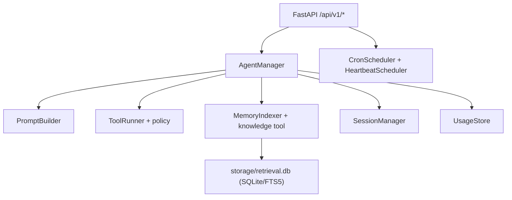

# Backend

FastAPI backend for Mini-OpenClaw LangChain.

## Core Responsibilities

- Multi-agent runtime management (`AgentManager`).
- Chat execution (sync + SSE stream) with LangChain `create_agent`.
- Tool execution with policy gates and audit trails.
- Scheduler runtime (cron + heartbeat) with API control.
- Retrieval over memory/knowledge using SQLite-first indexes.
- Per-agent usage accounting.

## Service Graph


```mermaid
flowchart TB
  API["FastAPI /api/v1/*"] --> AM["AgentManager"]
  AM --> PROMPT["PromptBuilder"]
  AM --> TOOLS["ToolRunner + policy"]
  AM --> RETR["MemoryIndexer + knowledge tool"]
  RETR --> DB["storage/retrieval.db (SQLite/FTS5)"]
  AM --> SESS["SessionManager"]
  AM --> USAGE["UsageStore"]
  API --> SCH["CronScheduler + HeartbeatScheduler"]
```

## Runtime Config Matrix

| Path                                          | Purpose                                     |
| --------------------------------------------- | ------------------------------------------- |
| `runtime.retrieval.storage.engine`            | `sqlite` (default) or fallback `json`.      |
| `runtime.retrieval.storage.db_path`           | Relative DB path per agent workspace.       |
| `runtime.retrieval.storage.fts_prefilter_k`   | Candidate count before semantic scoring.    |
| `runtime.tool_network.allow_http_schemes`     | Allowed URL schemes for fetch tools.        |
| `runtime.tool_network.block_private_networks` | Block localhost/private/link-local targets. |
| `runtime.tool_network.max_redirects`          | Redirect safety cap.                        |
| `runtime.tool_network.max_content_bytes`      | Maximum fetched response size.              |
| `runtime.chat_enabled_tools`                  | Explicit chat-trigger high-risk tools.      |
| `runtime.tool_execution.terminal.*`           | Terminal sandbox, allowlist, and limits.    |
| `runtime.scheduler.api_enabled`               | Enable/disable scheduler API routes.        |
| `runtime.scheduler.runs_query_default_limit`  | Default limit for runs/failures queries.    |
| `runtime.heartbeat.*`                         | Heartbeat schedule + execution window.      |
| `runtime.cron.*`                              | Cron polling, retry/backoff, retention.     |
| `runtime.llm_runtime.profile`                 | Active LLM profile name override.           |

## LLM Profiles

- Provider resolution is profile-driven (`llm_profiles` + `default_llm_profile`).
- Driver model is `openai_compatible` for OpenAI-compatible providers.
- Azure AI Foundry is supported through the `azure_foundry` profile template.
- Usage accounting prefers explicit profile provider IDs.

## LLM Model Selection (Tool Loop)

- Tool-enabled loops can be overridden with:
  - `TOOL_LOOP_MODEL` (global override for all configured models).
  - `TOOL_LOOP_MODEL_OVERRIDES` (per-model mapping).
- `TOOL_LOOP_MODEL_OVERRIDES` supports:
  - JSON object format (preferred): `{"source-model": "tool-model"}`
  - comma-separated key/value format: `source-model=tool-model,source2=tool2`
- If no override applies, the configured model is used as-is.

## API Reference

### Chat / Sessions / Agents

- `POST /api/v1/agents/{agent_id}/chat`
- `GET|POST /api/v1/agents/{agent_id}/sessions`
- `PUT|DELETE /api/v1/agents/{agent_id}/sessions/{session_id}`
- `POST /api/v1/agents/{agent_id}/sessions/{session_id}/archive`
- `POST /api/v1/agents/{agent_id}/sessions/{session_id}/restore`
- `GET|POST|DELETE /api/v1/agents`
- `POST /api/v1/agents/bulk-delete`
- `POST /api/v1/agents/bulk-export`
- `POST /api/v1/agents/bulk-runtime-patch`
- `GET /api/v1/agents/templates`
- `GET /api/v1/agents/templates/{template_name}`
- `GET /api/v1/agents/{agent_id}/runtime-diff`

### Files / Tokens / Usage

- `GET|POST /api/v1/agents/{agent_id}/files`
- `GET /api/v1/agents/{agent_id}/files/index`
- `GET /api/v1/skills`
- `GET /api/v1/agents/{agent_id}/tokens/session/{session_id}`
- `POST /api/v1/agents/{agent_id}/tokens/files`
- `GET /api/v1/agents/{agent_id}/usage/summary`
- `GET /api/v1/agents/{agent_id}/usage/records`

### Config

- `GET|PUT /api/v1/agents/{agent_id}/config/rag-mode`
- `GET|PUT /api/v1/agents/{agent_id}/config/runtime` (validated, atomic write)
- `GET|PUT /api/v1/config/tracing` (persisted in `storage/runtime_state.json`)

### Scheduler

- `GET|POST /api/v1/agents/{agent_id}/scheduler/cron/jobs`
- `PUT|DELETE /api/v1/agents/{agent_id}/scheduler/cron/jobs/{job_id}`
- `POST /api/v1/agents/{agent_id}/scheduler/cron/jobs/{job_id}/run`
- `GET /api/v1/agents/{agent_id}/scheduler/cron/runs`
- `GET /api/v1/agents/{agent_id}/scheduler/cron/failures`
- `GET|PUT /api/v1/agents/{agent_id}/scheduler/heartbeat`
- `GET /api/v1/agents/{agent_id}/scheduler/heartbeat/runs`
- `GET /api/v1/agents/{agent_id}/scheduler/metrics`
- `GET /api/v1/agents/{agent_id}/scheduler/metrics/timeseries`

## Threat Model (Current)

- Workspace path escape prevention in file tools/endpoints.
- URL fetch restrictions (scheme, host policy, content bounds, redirect cap).
- Terminal command allowlist + process sandbox backend + environment secret scrubbing.
- Autonomous tool calls blocked unless explicitly allowlisted.
- API middleware:
  - admin bearer token gate (`APP_ADMIN_TOKEN`)
  - trusted hosts
  - CORS restrictions
  - rate limiting
  - baseline hardening headers

Known limitations:

- Sandbox guarantees are host-local and depend on available OS sandbox backend.
- In `hybrid_auto` mode without a compatible backend, terminal execution is denied unless explicitly set to `unsafe_none`.

## Retrieval Notes

- Default engine: SQLite (`storage/retrieval.db`) per agent.
- `index_meta` stores digest + schema version.
- `chunks_fts` provides lexical prefilter.
- Semantic + lexical blending is preserved from previous scoring.
- Legacy JSON index is imported on first SQLite use, and JSON read fallback remains available.

## Operations

- Scheduler run/failure logs are JSONL in each workspace `storage/`.
- Cron and heartbeat records now include `started_at_ms`, `finished_at_ms`, `duration_ms`, and schedule lag where applicable.
- Metrics endpoints aggregate these records into windowed percentiles (`p50/p90/p99`) and bucketed trends.
- Heartbeat skip states include `skipped_no_prompt` for empty/comment-only prompts.
- Cron and heartbeat write paths are lock-protected.

## Local Run

```bash
cd backend
uv venv --python=python3.13.7
uv pip install -r requirements.txt
cp .env.example .env
uv run uvicorn app:app --host 127.0.0.1 --port 8000
```

Minimum required env:

- `APP_ADMIN_TOKEN`
- one API key for the active LLM profile (for example `DEEPSEEK_API_KEY`, `OPENAI_API_KEY`, or `AZURE_FOUNDRY_API_KEY`)

Health check:

```bash
curl http://127.0.0.1:8000/api/v1/health
```

## Tests

```bash
cd backend
./.venv/bin/pytest -q
```
