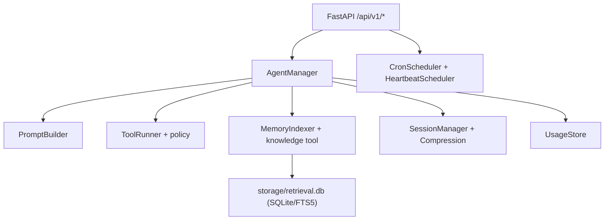

# Backend

FastAPI backend for Mini-OpenClaw LangChain.

## Core Responsibilities

- Multi-agent runtime management (`AgentManager`).
- Chat execution (sync + SSE stream) with LangChain `create_agent`.
- Tool execution with policy gates and audit trails.
- Scheduler runtime (cron + heartbeat) with API control.
- Retrieval over memory/knowledge using SQLite-first indexes.
- Per-agent usage accounting.

## Canonical Tool Catalog

Aliases were removed in favor of one canonical name per capability.

- `terminal`, `python_repl`, `fetch_url`
- `read_files` (supports both `path` and `paths`)
- `read_pdf` (optional dependency: `requirements-pdf.txt`)
- `search_knowledge_base`, `web_search`
- `sessions_list`, `session_history`, `agents_list`
- `scheduler_cron_jobs`, `scheduler_cron_runs`
- `scheduler_heartbeat_status`, `scheduler_heartbeat_runs`
- `apply_patch`

## Service Graph


```mermaid
flowchart TB
  API["FastAPI /api/v1/*"] --> AM["AgentManager"]
  AM --> PROMPT["PromptBuilder"]
  AM --> TOOLS["ToolRunner + policy"]
  AM --> RETR["MemoryIndexer + knowledge tool"]
  RETR --> DB["storage/retrieval.db (SQLite/FTS5)"]
  AM --> SESS["SessionManager + Compression"]
  AM --> USAGE["UsageStore"]
  API --> SCH["CronScheduler + HeartbeatScheduler"]
```

## Workspace Layout

Each agent workspace is self-contained under `backend/workspaces/<agent_id>/`.

- `workspace/`: prompt files such as `AGENTS.md`, `SOUL.md`, `USER.md`, `BOOTSTRAP.md`
- `memory/`: long-lived memory files and retrieval source material
- `knowledge/`: optional knowledge base inputs
- `skills/`: agent-local skill files
- `SKILLS_SNAPSHOT.md`: generated from that workspace's `skills/` directory
- `storage/`: sessions, scheduler state, usage records, and retrieval indexes

Root `backend/skills/` acts as the seed source for new workspaces only. Existing
agent workspaces are not re-synced from root on backend restart.

## Agent Loop Architecture

The backend keeps one public orchestrator (`AgentManager`) and now separates
loop concerns into dedicated graph modules:

- `graph/retrieval_orchestrator.py`
- `graph/tool_orchestrator.py`
- `graph/usage_orchestrator.py`
- `graph/stream_orchestrator.py`
- `graph/agent_loop_types.py`

This separation is structural only; request/response and stream behavior are unchanged.

### Loop Module Responsibilities

| Module                      | Responsibility                                                                          | Side Effects                                                    |
| --------------------------- | --------------------------------------------------------------------------------------- | --------------------------------------------------------------- |
| `retrieval_orchestrator.py` | Decide whether RAG is active and build retrieval envelope (`results`, `rag_context`).   | None (pure orchestration around `MemoryIndexer`).               |
| `tool_orchestrator.py`      | Build policy-filtered LangChain tools and create loop agent (`create_agent`).           | Creates tool runner and may switch to tool-loop model override. |
| `stream_orchestrator.py`    | Token/reasoning extraction and incremental token diff logic for stream updates.         | None (pure content parsing helpers).                            |
| `usage_orchestrator.py`     | Normalize usage payloads, dedupe by source, compute signatures, and persist usage rows. | Writes to `UsageStore` when usage is finalized.                 |
| `agent_loop_types.py`       | Typed state containers for streaming and retrieval stages.                              | None.                                                           |

### Run-Once Loop (`AgentManager.run_once`)

1. Resolve runtime and model profile
   - Load agent-effective runtime config (global + workspace config).
   - Resolve active LLM profile and instantiate/reuse `ChatOpenAI`.

2. Build retrieval envelope
   - `RetrievalOrchestrator.build_envelope(...)` checks `runtime.rag_mode`.
   - If enabled, run memory retrieval through `MemoryIndexer.retrieve(...)`.
   - Build transient request context in this exact format:
     - `"[Memory Retrieval Results]\n- (score) text ..."`

3. Build prompt and message list
   - `PromptBuilder` assembles system prompt from workspace files.
   - Conversation history is converted into LangChain messages.
   - Retrieval context (if any) is appended as a system message.

4. Build tool-enabled agent
   - `ToolOrchestrator.build_agent(...)` wires:
     - available mini tools
     - explicit trigger allowlist (`chat`, `cron`, `heartbeat`)
     - tool runner with retry-guard
     - LangChain structured tools
   - Optional tool-loop model overrides come from the resolved agent `llm` config.

5. Execute agent
   - Invoke with recursion limit and callbacks.
   - Callback stack includes internal audit + usage capture + optional tracing callbacks.

6. Aggregate and persist usage
   - `UsageOrchestrator` normalizes callback usage payloads, dedupes repeated message IDs,
     computes prices, and writes `UsageStore` records.
   - Response payload is unchanged (`text` or `structured_response` + `messages` + `usage`).

### Streaming Loop (`AgentManager.astream`)

The stream path follows the same build stages and then emits SSE-aligned events:

- `run_start`
- `agent_update`
- `retrieval` (when RAG is enabled)
- `tool_start`
- `tool_end`
- `reasoning`
- `token`
- `new_response`
- `usage`
- `done`
- `error`

`stream_orchestrator` utilities preserve token extraction, incremental diffing, and
reasoning extraction logic so event ordering/content remains stable.

`StreamLoopState` keeps stream-only mutable state isolated from orchestration steps:

- `pending_new_response`: flips true when a tool result finishes and a new model segment should begin.
- `final_tokens`: linear token buffer used to assemble final `done.content`.
- `fallback_final_text`: model-update fallback when message token stream is absent.
- `token_source`: tracks `messages` vs `updates` for deterministic stream metadata.
- `latest_model_snapshot`: previous update snapshot for incremental token diff.
- `emitted_reasoning`: dedupe set for reasoning snippets.
- `emitted_agent_update`: ensures at least one model progress event is emitted.

### Tool Calling Flow

1. Agent chooses tool call in the model node.
2. Tool call is routed through `ToolRunner`.
3. Policy checks and retry-guard are enforced before execution.
4. Tool outputs are emitted into stream events and fed back into the agent loop.
5. Audit callbacks capture tool start/end and associate them with `run_id`/`session_id`.

### Memory, Embeddings, and Retrieval Flow

`MemoryIndexer` handles retrieval for `memory/MEMORY.md`:

1. Resolve retrieval runtime settings (`top_k`, chunking, blend weights).
2. Resolve storage engine:
   - SQLite (default) with FTS prefilter and vector similarity.
   - JSON fallback maintained for compatibility/migration safety.

3. Generate query embedding (if embedding credentials/provider are available).
4. Retrieve chunks and blend lexical + semantic scores.
5. Return ranked retrieval rows consumed by the agent loop.

Embedding behavior:

- Provider/model come from runtime/global config and environment keys.
- If embedding calls fail, query embedding becomes empty and retrieval continues with
  lexical scoring (no agent-loop crash).

### Observability and Accounting

- `AuditCallbackHandler`: run/step/tool/message-link audit files.
- `UsageCaptureCallbackHandler`: captures per-call model usage payloads.
- `UsageOrchestrator`: dedupe + normalize + compute cost + persist usage row.
- Optional external tracing callbacks are attached when tracing is enabled.

## Trace Event Model

Trace reads merge two persisted JSONL sources inside each agent workspace into one
normalized event feed:

- `storage/audit/steps.jsonl` -> `source: "audit.steps"`
- `storage/runs_events.jsonl` -> `source: "runs.events"`

Both sources are projected into the same record shape before the API returns them:

- `event_id`
- `timestamp_ms`
- `agent_id`
- `run_id`
- `session_id`
- `trigger_type`
- `event`
- `summary`
- `details`
- `source`

Behavior notes:

- `summary` is synthesized for common tool and LLM lifecycle events so list views can
  render a compact human-readable description without reparsing raw payloads.
- Duplicate events emitted into both source logs are deduplicated by a normalized
  signature before sorting.
- List reads are reverse chronological and support time-window filters, event/trigger
  filters, run/session filters, full-text query matching over `summary` and `details`,
  and cursor pagination.

### Current Behavior Notes

- LLM routing is agent-scoped and resolved at runtime from config precedence.
- Provider credentials are validated lazily when a selected agent actually needs them.
- Skills are workspace-local once an agent exists; snapshots are regenerated from local `skills/`.
- Scheduler workers are started per agent rather than only for the default workspace.

## Runtime Config Matrix

| Path                                          | Purpose                                      |
| --------------------------------------------- | -------------------------------------------- |
| `runtime.retrieval.storage.engine`            | `sqlite` (default) or fallback `json`.       |
| `runtime.retrieval.storage.db_path`           | Relative DB path per agent workspace.        |
| `runtime.retrieval.storage.fts_prefilter_k`   | Candidate count before semantic scoring.     |
| `runtime.tool_network.allow_http_schemes`     | Allowed URL schemes for fetch tools.         |
| `runtime.tool_network.block_private_networks` | Block localhost/private/link-local targets.  |
| `runtime.tool_network.max_redirects`          | Redirect safety cap.                         |
| `runtime.tool_network.max_content_bytes`      | Maximum fetched response size.               |
| `runtime.chat_enabled_tools`                  | Explicit chat-trigger high-risk tools.       |
| `runtime.tool_execution.terminal.*`           | Terminal sandbox, command policy, and limits. |
| `runtime.scheduler.api_enabled`               | Enable/disable scheduler API routes.         |
| `runtime.scheduler.runs_query_default_limit`  | Default limit for runs/failures queries.     |
| `runtime.heartbeat.*`                         | Heartbeat schedule + execution window.       |
| `runtime.cron.*`                              | Cron polling, retry/backoff, retention.      |
| `runtime.llm.default`                         | Agent default profile id (`provider.model`). |
| `runtime.llm.fallbacks`                       | Ordered fallback profile ids.                |
| `runtime.llm.tool_loop_model`                 | Optional tool-loop model name override.      |
| `runtime.llm.tool_loop_model_overrides`       | Optional per-model-name tool-loop overrides. |

## LLM Profiles

- Provider resolution is profile-driven (`llm_profiles` + `llm_defaults` / agent `llm`).
- Driver model is `openai_compatible` for OpenAI-compatible providers.
- `llm_profiles` supports provider groups with `models` entries that expand to dotted profile ids such as `openai.gpt_4o_mini`.
- Usage accounting prefers explicit profile provider IDs.
- `LLM_PROFILES_JSON` env overrides are no longer used.

### Route Precedence

Effective route resolution uses this order:

1. Workspace config `backend/workspaces/<agent_id>/config.json` -> `llm`
2. Root `agent_llm_overrides.<agent_id>`
3. Root `llm_defaults`
4. Legacy `DEFAULT_LLM_PROFILE` only when no effective default is configured

`fallbacks: []` explicitly disables inherited fallbacks.

### Validation Semantics

- Startup validates route structure and profile references.
- Startup does not require credentials for unused providers.
- Missing credentials for the selected default profile fail that agent run.
- Missing credentials for fallback profiles are skipped when fallback policy allows continued routing.

## LLM Model Selection (Tool Loop)

- Tool-enabled loops can be overridden per agent in `runtime.llm` with:
  - `tool_loop_model` for a same-provider replacement model name
  - `tool_loop_model_overrides` for exact model-name remaps
- If no override applies, the configured model is used as-is.
- `TOOL_LOOP_MODEL` and `TOOL_LOOP_MODEL_OVERRIDES` env vars are no longer used.

## Skills and Snapshots

- `GET /api/v1/skills` lists the root skill catalog only.
- `GET /api/v1/agents/{agent_id}/skills` lists the selected agent's local skills and refreshes that workspace snapshot first.
- In agent file and token APIs, `skills/...` paths resolve inside that agent workspace.
- Saving `skills/...` through the agent file API refreshes that same agent's `SKILLS_SNAPSHOT.md`.
- `backend/SKILLS_SNAPSHOT.md` is no longer part of runtime behavior.

## Agent Templates

- Runtime templates live in `backend/agent_templates/*.json`.
- Each template is a JSON object with `description` and `runtime_config`.
- `runtime_config` is validated through the same runtime parser used for agent config updates, so unknown keys and unsupported legacy fields are rejected consistently.
- Template defaults and supported runtime keys should be derived from `backend/config.json`, not copied from stale per-workspace configs.
- See `backend/agent_templates/README.md` for the catalog contract, inheritance rules, and extension guidance.

## API Reference

### Chat / Sessions / Agents

- `POST /api/v1/agents/{agent_id}/chat`
- `GET|POST /api/v1/agents/{agent_id}/sessions`
- `GET /api/v1/agents/{agent_id}/sessions/{session_id}/messages`
- `GET /api/v1/agents/{agent_id}/sessions/{session_id}/history`
- `PUT|DELETE /api/v1/agents/{agent_id}/sessions/{session_id}`
- `POST /api/v1/agents/{agent_id}/sessions/{session_id}/archive`
- `POST /api/v1/agents/{agent_id}/sessions/{session_id}/restore`
- `POST /api/v1/agents/{agent_id}/sessions/{session_id}/compress`
- `POST /api/v1/agents/{agent_id}/sessions/{session_id}/generate-title`
- `GET|POST|DELETE /api/v1/agents`
- `POST /api/v1/agents/bulk-delete`
- `POST /api/v1/agents/bulk-export`
- `POST /api/v1/agents/bulk-runtime-patch`
- `GET /api/v1/agents/templates`
- `GET /api/v1/agents/templates/{template_name}`
- `GET /api/v1/agents/{agent_id}/runtime-diff`
- `GET /api/v1/agents/{agent_id}/tools`
- `PUT /api/v1/agents/{agent_id}/tools/selection`

`GET /api/v1/agents` includes per-agent `llm_status` with route validity, runnability,
resolved default profile, fallback profiles, warnings, and errors.

### Files / Tokens / Usage

- `GET|POST /api/v1/agents/{agent_id}/files`
- `GET /api/v1/agents/{agent_id}/files/index`
- `GET /api/v1/skills`
- `GET /api/v1/agents/{agent_id}/skills`
- `GET /api/v1/agents/{agent_id}/tokens/session/{session_id}`
- `POST /api/v1/agents/{agent_id}/tokens/files`
- `GET /api/v1/agents/{agent_id}/usage/summary`
- `GET /api/v1/agents/{agent_id}/usage/records`

### Config

- `GET|PUT /api/v1/agents/{agent_id}/config/rag-mode`
- `GET|PUT /api/v1/agents/{agent_id}/config/runtime` (validated, atomic write)
- `GET|PUT /api/v1/config/tracing` (persisted in `storage/runtime_state.json`)

### Traces

- `GET /api/v1/agents/{agent_id}/traces/events`
  Supports `window`, `event`, `trigger`, `run_id`, `session_id`, `q`, `limit`, and `cursor`.
- `GET /api/v1/agents/{agent_id}/traces/events/{event_id}`
  Returns one normalized persisted trace event from `audit.steps` or `runs.events`.

### Scheduler

- `GET|POST /api/v1/agents/{agent_id}/scheduler/cron/jobs`
- `PUT|DELETE /api/v1/agents/{agent_id}/scheduler/cron/jobs/{job_id}`
- `POST /api/v1/agents/{agent_id}/scheduler/cron/jobs/{job_id}/run`
- `GET /api/v1/agents/{agent_id}/scheduler/cron/runs`
- `GET /api/v1/agents/{agent_id}/scheduler/cron/failures`
- `GET|PUT /api/v1/agents/{agent_id}/scheduler/heartbeat`
- `GET /api/v1/agents/{agent_id}/scheduler/heartbeat/runs`
- `GET /api/v1/agents/{agent_id}/scheduler/metrics`
- `GET /api/v1/agents/{agent_id}/scheduler/metrics/timeseries`

## Threat Model (Current)

- Workspace path escape prevention in file tools/endpoints.
- URL fetch restrictions (scheme, host policy, content bounds, redirect cap).
- Terminal command policy modes (`auto`, `allowlist`, `denylist`) + process sandbox backend + environment secret scrubbing.
- Autonomous tool calls blocked unless explicitly allowlisted.
- API middleware:
  - admin bearer token gate (`APP_ADMIN_TOKEN`)

## Local Runtime and Proxy Modes

Two local development modes are supported:

1. `./oml start`
   - backend binds `127.0.0.1:8000`
   - frontend binds `127.0.0.1:3000`
   - bash and PowerShell CLIs default `OML_ENABLE_FRONTEND_PROXY=true`, so backend serves the app at `http://127.0.0.1:8000`

2. Manual split-server development
   - backend started directly on `127.0.0.1:8000`
   - frontend started with `npm run dev` on `127.0.0.1:3000`
   - Next dev rewrites `/api/v1/*` to `http://127.0.0.1:8000/api/v1/*`

Backend proxy env behavior:

- `APP_ENABLE_FRONTEND_PROXY` and `APP_FRONTEND_PROXY_URL` remain backend-owned runtime envs
- `./oml` controls them through:
  - `OML_ENABLE_FRONTEND_PROXY=true|false|inherit`
  - `OML_FRONTEND_PROXY_URL=http://127.0.0.1:3000`
- `OML_ENABLE_FRONTEND_PROXY=inherit` is the mode that lets backend process env or `backend/.env` decide proxy behavior
  - trusted hosts
  - CORS restrictions
  - rate limiting
  - baseline hardening headers

Known limitations:

- Sandbox guarantees are host-local and depend on available OS sandbox backend.
- In `hybrid_auto` mode without a compatible backend, terminal execution is denied unless explicitly set to `unsafe_none`.

## Retrieval Notes

- Default engine: SQLite (`storage/retrieval.db`) per agent.
- `index_meta` stores digest + schema version.
- `chunks_fts` provides lexical prefilter.
- Semantic + lexical blending is preserved from previous scoring.
- Legacy JSON index is imported on first SQLite use, and JSON read fallback remains available.

## Operations

- Scheduler run/failure logs are JSONL in each workspace `storage/`.
- Cron and heartbeat records now include `started_at_ms`, `finished_at_ms`, `duration_ms`, and schedule lag where applicable.
- Metrics endpoints aggregate these records into windowed percentiles (`p50/p90/p99`) and bucketed trends.
- Heartbeat skip states include `skipped_no_prompt` for empty/comment-only prompts.
- Cron and heartbeat write paths are lock-protected.

## Local Run

```bash
cd backend
uv venv --python=python3.13.7
uv pip install -r requirements.txt
# Optional PDF tool support:
# uv pip install -r requirements-pdf.txt
cp .env.example .env
uv run uvicorn app:app --host 127.0.0.1 --port 8000
```

Minimum required env:

- `APP_ADMIN_TOKEN`
- one API key for the active LLM profile (for example `DEEPSEEK_API_KEY`, `OPENAI_API_KEY`, or `AZURE_FOUNDRY_API_KEY`)

Health check:

```bash
curl http://127.0.0.1:8000/api/v1/health
```

## Tests

```bash
cd backend
./.venv/bin/pytest -q
```
