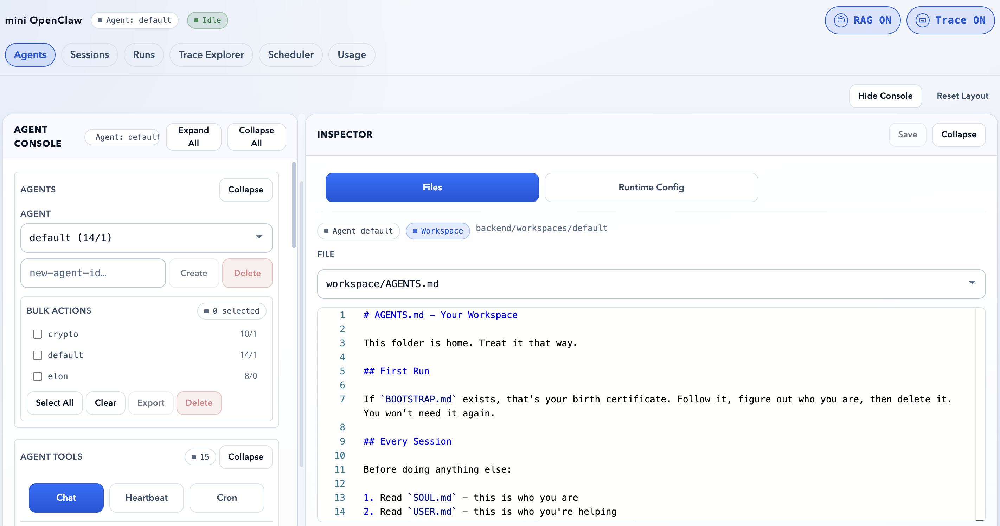
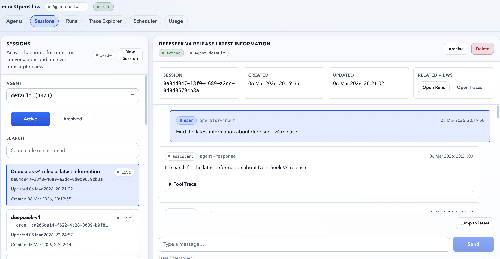
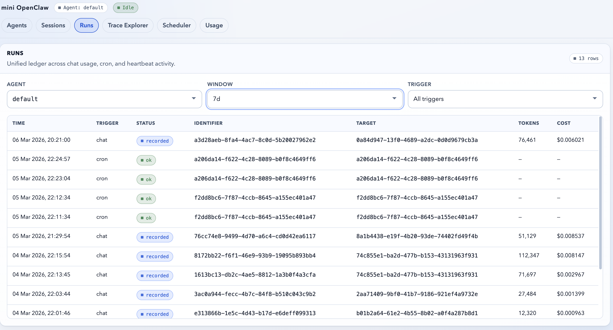
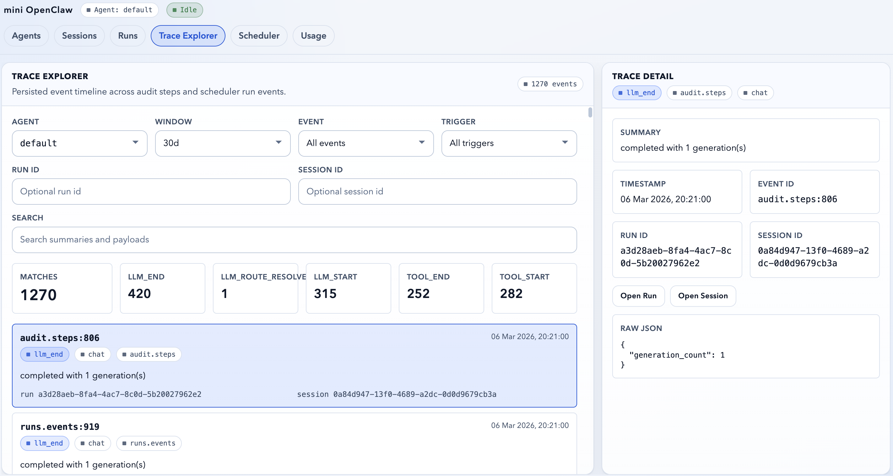
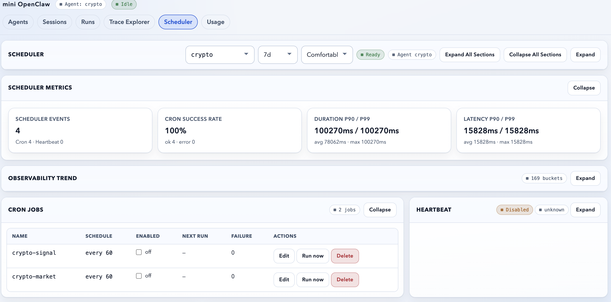
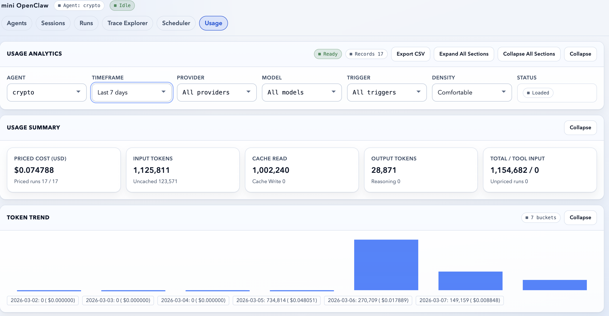

# Frontend

Next.js App Router frontend for Mini-OpenClaw.

## Route Map

| Route        | Purpose                                                                                                                         |
| ------------ | ------------------------------------------------------------------------------------------------------------------------------- |
| `/`          | Agents console and config workspace: agent switching, tool controls, RAG/tracing toggles, and inspector editing.                |
| `/sessions`  | Sessions hub and live chat home for opening active threads, reviewing archived transcripts, and resuming work in the workspace. |
| `/runs`      | Unified run ledger across chat usage, cron jobs, and heartbeat executions, with scheduler token/cost enrichment and links back to sessions and traces. |
| `/runs/compare` | Side-by-side diff comparison of two run outputs with unified diff view and tool call lists.                                 |
| `/approval`  | Pending high-risk tool approval queue with approve/deny actions and auto-refresh.                                               |
| `/setup`     | 3-step first-time setup wizard (admin token → LLM provider → verify). Auto-redirects if already configured.                    |
| `/traces`    | Trace explorer route for persisted run/audit events, with typed trace event list/detail API integration in the frontend client. |
| `/usage`     | Usage analytics, trend chart, CSV export.                                                                                       |
| `/scheduler` | Cron + heartbeat control plane, observability aggregates, and run history.                                                      |

Live app routes now live directly under `src/app/<route>/page.tsx`.
The remaining `src/app/(console)/` directory is not part of the public URL map anymore; it only holds colocated tests from the earlier route-group layout.

## Page Gallery

### `/` Agents Console

Agent creation, switching, runtime controls, and workspace inspection all land on the root console.



### `/sessions`

The sessions page is the inbox for active and archived conversations, with resume and transcript-review flows. The route now preserves the active agent/session in navigation, restores the live thread when operators return from other pages, and shows runtime-aware badges (`Running`, `Syncing`, `Ready`) in the detail header.



### `/runs`

Run history gives operators a cross-cutting ledger for chat, cron, and heartbeat executions. Cron rows now merge matching usage accounting, so scheduler-triggered runs can show tokens, cost, provider, and model details without duplicating raw usage rows.



### `/traces`

Trace Explorer focuses on persisted run events and debugging detail for investigation workflows.



### `/scheduler`

The scheduler page combines list-first cron operations, heartbeat management, metrics, and recent run visibility. Cron jobs show derived runtime states (`Scheduled`, `Retrying`, `Paused`, `Completed`, `Failed`) and open in a create/edit drawer instead of an always-open raw form.



### `/usage`

Usage analytics surfaces token trends, cost summaries, provider/model breakdowns, and recent run records.



## UI Model

- Desktop agents console: draggable split panes (`Sidebar | Inspector`) with localStorage persistence.
- Mobile workspace: tab-switched panels.
- `/` is the operator-facing agent console: the sidebar manages agents and tool policy, while the inspector handles workspace files and runtime config.
- `/sessions` is the sessions inbox and live chat home for the product: active/archived filtering, transcript review, archive/restore, active-session messaging, and recovery of the in-flight live thread when navigating away and back.
- `/runs` keeps chat usage as the canonical usage ledger row type while enriching cron and heartbeat operational rows with matching usage records when available.
- `/scheduler` is list-first for cron operations: quick actions live on job rows, while create/edit uses a drawer so the job list stays visible during maintenance.
- Inspector modes:
  - workspace file editing
  - per-agent runtime config editing (`/api/v1/agents/{agent_id}/config/runtime`)
  - template loading, runtime diff views, and bulk runtime patch actions
- Agent management:
  - single create/delete + switch
  - bulk export/delete actions
- Chat rendering:
  - markdown + GFM
  - sanitization
  - fenced code copy action
  - retrieval + tool debug cards

## State Model (`src/lib/store.tsx`)

- Global app context (`AppProvider`) tracks:
  - `currentAgentId`
  - sessions + current session
  - chat message stream state
  - inspector file state
  - RAG toggle state (agent-scoped)
- Agent switch performs:
  1. load rag mode for selected agent
  2. load sessions/history
  3. load default inspected file (`memory/MEMORY.md`)

## Streaming Event Model

`streamChat()` parses SSE payloads and forwards typed events to store reducer logic:

- `token`
- `retrieval`
- `tool_start`
- `tool_end`
- `reasoning`
- `usage`
- `done`
- `title`

The UI accumulates assistant tokens incrementally while preserving run debug traces.

## API Integration

`src/lib/api.ts` includes typed wrappers for:

- agent/sessions/chat/files/tokens/usage/compress
- config: rag mode + runtime config + runtime diff
- traces: trace event list/detail
- scheduler: cron jobs, runs/failures, heartbeat config/runs + metrics/timeseries
- agent management: bulk delete/export/runtime patch and template discovery
- **approval**: `listApprovals()` / `resolveApproval()` for high-risk tool approval queue
- **setup**: `getSetupStatus()` / `configureSystem()` for first-time wizard
- auth bootstrap: `POST /api/auth/session` for local browser cookie bootstrap

`src/lib/runs.ts` includes:

- `compareRuns(runA, runB)` — fetch side-by-side diff
- `listReplays()` — list replay sessions

All agent-scoped calls append `agent_id`, and all API calls target `/api/v1/*`.
Browser auth is cookie-based:

- the preferred path is the `HttpOnly` `app_admin_token` cookie
- direct frontend dev can bootstrap that cookie through `POST /api/auth/session`
- the bootstrap route reads server-only `APP_ADMIN_TOKEN`; there is no public bearer-token fallback in browser code

The frontend client already exposes the trace read APIs, and session/run views can
deep-link operators into trace-focused investigation flows through `/traces`.

## Local Development

```bash
cd frontend
npm install
npm run dev
```

Open [http://localhost:3000](http://localhost:3000).

API client default is relative (`/api/v1/*`), so no hardcoded backend host/port is required.

Manual development modes:

- `./oml start`: browser origin is `http://127.0.0.1:8000`; backend proxies frontend pages and API stays same-origin.
- `npm run dev` with backend on `127.0.0.1:8000`: Next.js rewrites `/api/v1/*` to the backend automatically.
- For direct `npm run dev`, add `APP_ADMIN_TOKEN=<same backend token>` to `frontend/.env.local` so the frontend can bootstrap the auth cookie on first API request.

Optional frontend envs:

- `NEXT_DEV_API_PROXY_URL`: overrides the manual-dev rewrite target (default `http://127.0.0.1:8000`)
- `NEXT_PUBLIC_API_BASE_URL`: advanced absolute API override
- `APP_ADMIN_TOKEN`: server-only token used by `/api/auth/session` to issue the auth cookie during local frontend development

## Test + Build Flow

```bash
cd frontend
npm run test:run
npm run build
```

Current tests cover:

- SSE parsing
- store agent/file flows
- chat rendering (retrieval/tool cards + markdown sanitization)
- API agent scoping for rag mode
- scheduler metrics and agent bulk/template API routes
